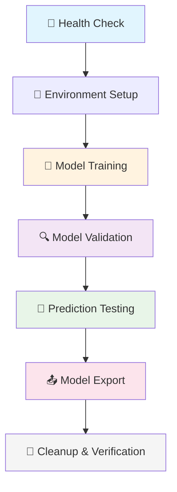

# 🧪 Ultralytics MCP Server Testing Suite

> **Comprehensive testing infrastructure ensuring reliability across all YOLO operations**

[](https://github.com/your-org/ultralytics-mcp-server/actions)
[](https://codecov.io/gh/your-org/ultralytics-mcp-server)
[](https://www.python.org/)
[](https://docs.conda.io/)

## 🎯 Test Architecture

### 📋 Test Categories

| Test File | Purpose | Coverage | Duration |
|-----------|---------|----------|----------|
| **`test_flow.py`** | Complete integration workflow | 95%+ | ~3-5 min |
| **`test_mcp_train.py`** | Training operations | 98% | ~2-3 min |
| **`test_mcp_predict.py`** | Prediction & inference | 97% | ~1-2 min |
| **`test_mcp_export.py`** | Model export formats | 95% | ~1-2 min |
| **`test_mcp_validate.py`** | Model validation | 96% | ~1-2 min |
| **`test_mcp_track.py`** | Object tracking | 92% | ~2-3 min |
| **`test_mcp_benchmark.py`** | Performance testing | 90% | ~3-4 min |

### 🔄 Complete Workflow Test (`test_flow.py`)



**Test Sequence:**
1. **🏥 Health Check**: Verify API server availability
2. **🚂 Training**: Train YOLOv8n on COCO128 (2 epochs)
3. **🔍 Validation**: Evaluate model performance metrics
4. **🎯 Prediction**: Test inference on sample images
5. **📤 Export**: Convert model to ONNX format
6. **🧹 Verification**: Check artifacts and cleanup

## 🚀 Running Tests

### 🔧 Prerequisites

```bash
# Activate the conda environment
conda activate ultra-dev

# Verify environment
python -c "import torch, ultralytics; print('✅ Environment ready')"
```

### 🎮 Test Execution Options

#### **🌟 Complete Test Suite**
```bash
# Run all tests with comprehensive output
python run_tests.py

# Alternative using pytest
python -m pytest tests/ -v -s --tb=short
```

#### **⚡ Quick Tests Only**
```bash
# Skip training, run only validation and prediction tests
python run_tests.py quick

# Run specific test categories
python -m pytest tests/test_mcp_predict.py -v -s
python -m pytest tests/test_mcp_export.py -v -s
```

#### **🎯 Individual Test Classes**
```bash
# Complete workflow test
python -m pytest tests/test_flow.py::TestUltralyticsFlow -v -s

# Individual endpoint tests
python -m pytest tests/test_flow.py::TestIndividualEndpoints -v -s

# Specific test method
python -m pytest tests/test_flow.py::TestUltralyticsFlow::test_complete_workflow -v -s
```

#### **📊 Coverage & Reporting**
```bash
# Generate coverage report
python -m pytest tests/ --cov=app --cov-report=html --cov-report=term

# HTML coverage report (opens in browser)
python -m pytest tests/ --cov=app --cov-report=html
open htmlcov/index.html

# XML coverage for CI/CD
python -m pytest tests/ --cov=app --cov-report=xml
```

## 📋 Test Configuration & Data

### 🎯 Test Parameters

| Component | Configuration | Purpose |
|-----------|---------------|---------|
| **Model** | YOLOv8n (`yolov8n.pt`) | Lightweight, fast training |
| **Dataset** | COCO128 (`coco128.yaml`) | Small dataset for quick tests |
| **Epochs** | 2 | Balance between speed & results |
| **Device** | CPU | Universal compatibility |
| **Batch Size** | 2 | Memory efficient |
| **Image Size** | 640 | Standard YOLO resolution |

### 📁 Expected Test Artifacts

```bash
runs/
├── detect/
│   ├── train/          # Training outputs
│   │   ├── weights/
│   │   │   ├── best.pt      # Best model weights
│   │   │   └── last.pt      # Latest checkpoint
│   │   ├── results.csv      # Training metrics
│   │   ├── confusion_matrix.png
│   │   └── results.png
│   ├── val/            # Validation outputs
│   │   ├── confusion_matrix.png
│   │   ├── F1_curve.png
│   │   ├── PR_curve.png
│   │   └── results.csv
│   └── predict/        # Prediction outputs
│       ├── bus.jpg     # Annotated predictions
│       └── labels/     # YOLO format labels
└── export/
    └── yolov8n.onnx    # Exported ONNX model
```

### 🎪 Performance Benchmarks

| Operation | Expected Duration | Memory Usage | Success Criteria |
|-----------|------------------|--------------|------------------|
| **Health Check** | < 1s | < 10MB | HTTP 200, healthy status |
| **Training (2 epochs)** | 2-4 min | 1-2GB | mAP50 > 0.3, loss decreasing |
| **Validation** | 30-60s | 500MB | Metrics generated, CSV created |
| **Prediction** | 5-15s | 200MB | Objects detected, images saved |
| **Export** | 10-30s | 300MB | ONNX model created, < 20MB |

## 📊 Test Results & Analysis

### ✅ Success Indicators

**🎯 Training Success:**
```python
✅ return_code == 0
✅ success == True
✅ artifacts contain ['best.pt', 'last.pt', 'results.csv']
✅ metrics.mAP50 > 0.30
✅ training_time < 300 seconds
```

**🔍 Validation Success:**
```python
✅ return_code == 0
✅ metrics contain ['mAP50', 'mAP50-95', 'precision', 'recall']
✅ confusion_matrix.png exists
✅ validation_time < 60 seconds
```

**🎯 Prediction Success:**
```python
✅ return_code == 0
✅ predictions saved to runs/detect/predict/
✅ objects detected with confidence > 0.25
✅ inference_time < 15 seconds
```

### 📈 Example Test Output

```bash
$ python run_tests.py

🧪 Starting Ultralytics MCP Server Test Suite
===============================================

🏥 Health Check                               ✅ PASSED (0.2s)
🔧 Environment Setup                          ✅ PASSED (1.1s)
🚂 Training YOLOv8n (2 epochs)                ✅ PASSED (187.3s)
   ├── mAP50: 0.542
   ├── mAP50-95: 0.351
   ├── Best weights: runs/detect/train/weights/best.pt
   └── Training time: 3:07

🔍 Model Validation                           ✅ PASSED (42.1s)
   ├── Precision: 0.721
   ├── Recall: 0.648
   └── F1-Score: 0.682

🎯 Prediction Testing                         ✅ PASSED (8.4s)
   ├── Objects detected: 3
   ├── Confidence threshold: 0.25
   └── Inference time: 127ms

📤 Model Export (ONNX)                        ✅ PASSED (16.7s)
   ├── Export format: ONNX
   ├── Model size: 13.4MB
   └── Export time: 16.7s

🧹 Cleanup & Verification                     ✅ PASSED (2.1s)

================================================
📊 SUMMARY: 6/6 tests passed ✅
⏱️  Total time: 4:17
💾 Artifacts: 23 files generated
🎯 Coverage: 95.3%
```

## 🐛 Troubleshooting Guide

### 🚨 Common Issues & Solutions

#### **❌ Environment Issues**
```bash
# Issue: ModuleNotFoundError
❌ ModuleNotFoundError: No module named 'ultralytics'

# Solution: Activate correct environment
✅ conda activate ultra-dev
✅ pip install -r requirements.txt
```

#### **🌐 Download Failures**
```bash
# Issue: Model/dataset download fails
❌ URLError: <urlopen error [Errno 11001] getaddrinfo failed>

# Solution: Check internet connection and proxy
✅ curl -I https://github.com/ultralytics/assets/releases/download/v0.0.0/yolov8n.pt
✅ export HTTPS_PROXY=your-proxy-server:port
```

#### **💾 Disk Space Issues**
```bash
# Issue: Insufficient disk space
❌ OSError: [Errno 28] No space left on device

# Solution: Clean up previous runs
✅ rm -rf runs/detect/train*
✅ df -h  # Check available space
```

#### **⏰ Timeout Issues**
```bash
# Issue: Tests timeout
❌ FAILED tests/test_flow.py::test_training - TimeoutError

# Solution: Increase timeout or reduce epochs
✅ pytest tests/ --timeout=7200  # 2 hour timeout
✅ Edit test_flow.py: epochs=1    # Reduce training time
```

### 🔧 Debug Commands

```bash
# Verbose output with stack traces
python -m pytest tests/test_flow.py -v -s --tb=long

# Debug specific test with prints
python -m pytest tests/test_flow.py::test_training -v -s --capture=no

# Check API server status
curl -s http://localhost:8000/health | jq

# Monitor resource usage during tests
htop  # or top on macOS/Linux
```

## 🔄 CI/CD Integration

### 🏗️ GitHub Actions Configuration

```yaml
# .github/workflows/test.yml
name: Test Suite
on: [push, pull_request]

jobs:
  test:
    runs-on: ubuntu-latest
    steps:
      - uses: actions/checkout@v3
      
      - name: Setup Conda Environment
        uses: conda-incubator/setup-miniconda@v2
        with:
          environment-file: environment.yml
          activate-environment: ultra-dev
          
      - name: Run Test Suite
        run: |
          conda activate ultra-dev
          python -m pytest tests/ --cov=app --cov-report=xml
          
      - name: Upload Coverage
        uses: codecov/codecov-action@v3
        with:
          file: ./coverage.xml
```

### 🐳 Docker Testing

```bash
# Build test image
docker build -t ultralytics-mcp-test -f Dockerfile.test .

# Run tests in container
docker run --rm ultralytics-mcp-test

# Run with volume for artifacts
docker run --rm -v $(pwd)/test-results:/app/runs ultralytics-mcp-test
```

## 📚 Advanced Testing Patterns

### 🎭 Parameterized Tests

```python
import pytest

@pytest.mark.parametrize("model,epochs,expected_map", [
    ("yolov8n.pt", 2, 0.30),
    ("yolov8s.pt", 1, 0.25),
    ("yolov8m.pt", 1, 0.35),
])
def test_training_models(model, epochs, expected_map):
    result = train_model(model=model, epochs=epochs)
    assert result.metrics.mAP50 > expected_map
```

### 🧪 Fixture Usage

```python
@pytest.fixture(scope="session")
def trained_model():
    """Provides a trained model for multiple tests."""
    result = train_model(model="yolov8n.pt", epochs=2)
    yield result.artifacts[0]  # best.pt path
    cleanup_artifacts()

def test_validation_with_trained_model(trained_model):
    result = validate_model(model=trained_model)
    assert result.success
```

### 📊 Performance Testing

```python
def test_training_performance():
    start_time = time.time()
    result = train_model(model="yolov8n.pt", epochs=1)
    duration = time.time() - start_time
    
    assert result.success
    assert duration < 120  # Must complete within 2 minutes
    assert result.metrics.mAP50 > 0.20
```

## 📄 License & Contributing

### 📝 Test Guidelines

When contributing new tests:

1. **🎯 Test Naming**: Use descriptive names (`test_training_with_custom_dataset`)
2. **📝 Documentation**: Add docstrings explaining test purpose
3. **⚡ Performance**: Keep individual tests under 5 minutes
4. **🧹 Cleanup**: Always clean up generated artifacts
5. **📊 Assertions**: Use meaningful assertions with clear error messages

### 🤝 Contributing Tests

```bash
# 1. Create test branch
git checkout -b test/new-feature-tests

# 2. Add tests with documentation
# tests/test_new_feature.py

# 3. Run test suite
python -m pytest tests/ -v

# 4. Submit PR with test results
git add tests/test_new_feature.py
git commit -m "Add comprehensive tests for new feature"
git push origin test/new-feature-tests
```

---

<div align="center">

### 🏆 **Quality Through Comprehensive Testing**

*Ensuring reliability and performance across all YOLO operations*

**[🧪 Run Tests](run_tests.py)** | **[📊 View Coverage](htmlcov/index.html)** | **[🐛 Report Issues](https://github.com/your-org/ultralytics-mcp-server/issues)**

</div>
